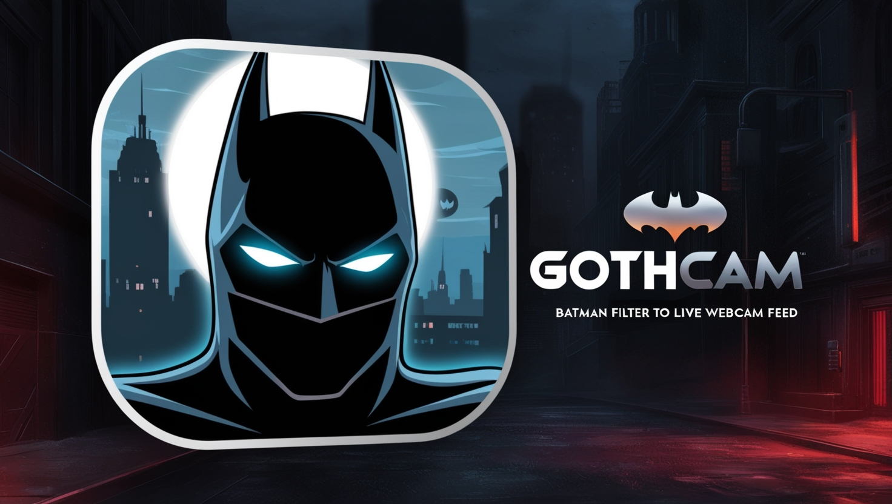

## Fonctionnalités

- **Détection de visage** : Utilisation de Haarcascade pour détecter les visages dans le flux vidéo.
- **Application de filtres** : Chargement et application de filtres personnalisés sur les visages détectés.
- **Interface utilisateur** : Interface graphique pour démarrer et arrêter la capture vidéo.

## Prérequis

- Python 3.x
- OpenCV
- Tkinter (pour l'interface graphique)

## Installation

1. Clonez le dépôt :
    ```bash
    git clone https://github.com/votre-utilisateur/gothcam.git
    cd gothcam
    ```

2. Installez les dépendances :
    ```bash
    pip install opencv-python-headless
    ```

3. Assurez-vous que les fichiers nécessaires sont présents dans le répertoire `_internal` :
    - `haarcascade_frontalface_default.xml`
    - `filter.png`

## Utilisation

1. Exécutez le script principal pour démarrer l'application :
    ```bash
    python ui.py
    ```

2. Suivez les instructions à l'écran pour démarrer la capture vidéo et appliquer les filtres.

## Structure du projet

- `ui.py` : Contient l'interface utilisateur et les fonctions d'initialisation.
- `_internal/` : Contient les fichiers nécessaires pour la détection de visage et les filtres.

## Dépannage

- **Erreur lors du chargement de l'image `filter.png`** :
    - Assurez-vous que le fichier `filter.png` est présent dans le répertoire `_internal`.
    - Vérifiez que le chemin d'accès au fichier est correct.

- **Erreur lors de l'ouverture de la webcam** :
    - Assurez-vous que votre webcam est correctement connectée et fonctionne.
    - Vérifiez les permissions d'accès à la webcam sur votre système.

## Contribuer

Les contributions sont les bienvenues ! Veuillez soumettre une pull request ou ouvrir une issue pour discuter des changements que vous souhaitez apporter.

## Licence

Ce projet est sous licence MIT. Voir le fichier [LICENSE](LICENSE) pour plus de détails.


